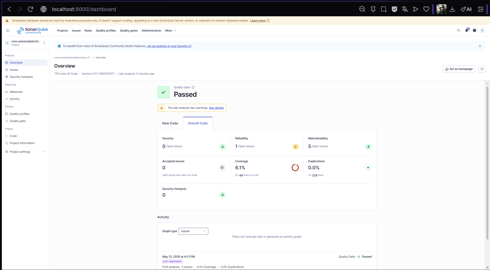
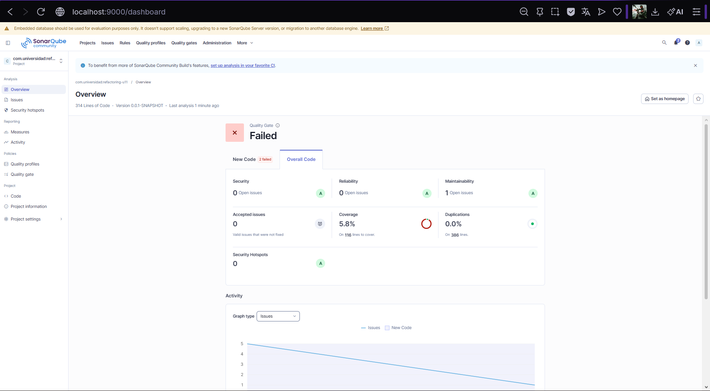

# Refactoring U11 — Eliminación de Bloaters con Extract Method, Extract Class y Value Objects

Proyecto Spring Boot que documenta el proceso completo de identificación y eliminación de code smells de tipo Bloater (Long Method, Large Class, Primitive Obsession) aplicando técnicas de refactorización: Extract Method, Extract Class e introducción de Value Objects, verificado con SonarQube.

---

## Prerrequisitos

- Java 17 o superior
- Maven 3.9+
- Docker Desktop instalado y en ejecución

---

## Cómo ejecutar el proyecto

### Compilar el proyecto

```bash
mvn compile
```

### Ejecutar pruebas

```bash
mvn clean verify
```

---

## Cómo levantar SonarQube con Docker

```bash
docker run -d \
  --name sonarqube \
  -p 9000:9000 \
  -e SONAR_ES_BOOTSTRAP_CHECKS_DISABLE=true \
  sonarqube:community
```

Esperar hasta ver en los logs:

```bash
docker logs -f sonarqube
# Esperar: "SonarQube is operational"
```

Acceder en `http://localhost:9000` con credenciales `admin / admin`.

---

## Cómo ejecutar el análisis SonarQube

```bash
mvn clean verify sonar:sonar -Dsonar.token=sqa_d356489b2b0a6c54d7689ea9de61f3f98e2a05bd
```

Ver resultados en:

```
http://localhost:9000/dashboard?id=com.universidad%3Arefactoring-u11
```

---

## Code Smells identificados en el análisis inicial

### 1. Long Method — `procesarPedido()`
El método `procesarPedido()` en `PedidoService` concentraba 4 responsabilidades en un solo método: validación del cliente, cálculo del total, aplicación de descuentos y notificación. Tenía alta complejidad ciclomática y era difícil de leer y testear.

### 2. Primitive Obsession — 12 parámetros primitivos
El método recibía 12 parámetros de tipo primitivo (`String`, `Long`, `boolean`, `List`) para representar conceptos del dominio como cliente, dirección y descuento. Esto es un Data Clump clásico que dificulta la validación y el mantenimiento.

### 3. Large Class — `PedidoService`
`PedidoService` tenía múltiples responsabilidades mezcladas: lógica de negocio, cálculos, notificaciones y persistencia. Violaba el principio de responsabilidad única (SRP).

### 4. Field Injection — `@Autowired` en campo
El repositorio se inyectaba mediante `@Autowired` en campo en lugar de inyección por constructor, lo que dificulta las pruebas unitarias y viola las recomendaciones de Spring.

---

## Técnicas de refactorización aplicadas

### Técnica 1 — Value Objects (Paso 2)

Se introdujeron 4 Value Objects para eliminar la Primitive Obsession:

| Clase | Concepto que representa | Parámetros que reemplaza |
|-------|------------------------|--------------------------|
| `Direccion` | Ubicación física | `clienteDireccion`, `clienteCiudad`, `clienteCodigoPostal` |
| `DatosCliente` | Datos del cliente | `clienteNombre`, `clienteEmail`, `clienteTelefono` + `Direccion` |
| `CodigoDescuento` | Descuento con lógica propia | `String codigoDescuento` + if/else de aplicación |
| `LineaPedido` | Una línea del pedido | `List<Long> productosIds` + `List<Integer> cantidades` |

Los Value Objects son **inmutables** — todos sus campos son `final` y no tienen setters. La validación se realiza en el constructor, garantizando que los objetos siempre están en un estado válido.

**Antes:**
```java
public String procesarPedido(Long clienteId, String clienteNombre,
    String clienteEmail, String clienteTelefono,
    String clienteDireccion, String clienteCiudad,
    String clienteCodigoPostal, List<Long> productosIds,
    List<Integer> cantidades, String metodoPago,
    boolean esUrgente, String codigoDescuento)
```

**Después:**
```java
public String procesarPedido(DatosCliente cliente,
    LineaPedido[] lineas, String metodoPago,
    boolean esUrgente, CodigoDescuento descuento)
```

---

### Técnica 2 — Extract Method (Paso 3)

El método `procesarPedido()` se dividió en 4 métodos con responsabilidad única y complejidad ciclomática reducida:

| Método extraído | Responsabilidad | CC |
|----------------|-----------------|-----|
| `calcularTotal()` | Suma el total de las líneas del pedido | 1 |
| `aplicarDescuento()` | Aplica el porcentaje de descuento | 1 |
| `notificarPedido()` | Delegado a NotificacionService | 1 |
| `persistirPedido()` | Crea y persiste el pedido | 1 |

**Método principal después del Extract Method:**
```java
public String procesarPedido(DatosCliente cliente,
                              LineaPedido[] lineas,
                              String metodoPago,
                              boolean esUrgente,
                              CodigoDescuento descuento) {
    double total = calcularTotal(lineas);
    double totalConDescuento = aplicarDescuento(total, descuento);
    notificacion.notificarPedido(cliente, esUrgente);
    return persistirPedido(cliente, totalConDescuento);
}
```

---

### Técnica 3 — Extract Class (Paso 4)

La lógica de notificación se extrajo a `NotificacionService`, una clase independiente con responsabilidad única. Se eliminó el uso de `System.out.println()` reemplazándolo por SLF4J.

**Antes:**
```java
// En PedidoService — responsabilidad ajena
System.out.println("Enviando email a: " + clienteEmail);
System.out.println("Pedido urgente: " + esUrgente);
```

**Después:**
```java
// NotificacionService — clase independiente
@Service
public class NotificacionService {
    private static final Logger log =
            LoggerFactory.getLogger(NotificacionService.class);

    public void notificarPedido(DatosCliente cliente, boolean urgente) {
        log.info("Enviando confirmacion de pedido a: {}", cliente.getEmail());
        if (urgente) {
            log.info("Pedido urgente para cliente: {}", cliente.getNombre());
        }
    }
}
```

---

## Comparativa de métricas SonarQube antes y después

| Categoría | Análisis Inicial | Análisis Final | Mejora |
|-----------|-----------------|----------------|--------|
| Reliability (Bugs) | 1 issue — Rating C | 0 issues — Rating A | ✅ |
| Maintainability | 5 issues — Rating A | 1 issue — Rating A | ✅ |
| Security | 0 issues — Rating A | 0 issues — Rating A | ✅ |
| Coverage | 6.1% | 5.8% | — |
| Duplicaciones | 0.0% | 0.0% | ✅ |
| Total issues | 6 | 1 | ✅ |

---

## Estructura del proyecto

```
src/
├── main/java/com/universidad/refactoring_u11/
│   ├── RefactoringU11Application.java
│   ├── domain/
│   │   ├── Pedido.java
│   │   ├── Producto.java
│   │   ├── DatosCliente.java       ← Value Object
│   │   ├── Direccion.java          ← Value Object
│   │   ├── CodigoDescuento.java    ← Value Object
│   │   └── LineaPedido.java        ← Value Object
│   ├── repository/
│   │   └── PedidoRepository.java
│   └── service/
│       ├── PedidoService.java      ← Refactorizado con Extract Method
│       └── NotificacionService.java ← Extract Class
docs/
├── sonar-dashboard-inicial.png
└── sonar-dashboard-final.png
sonar-project.properties
```

---

## Evidencias

### Dashboard SonarQube — Análisis inicial (código con smells)


### Dashboard SonarQube — Análisis final (después de refactorización)

